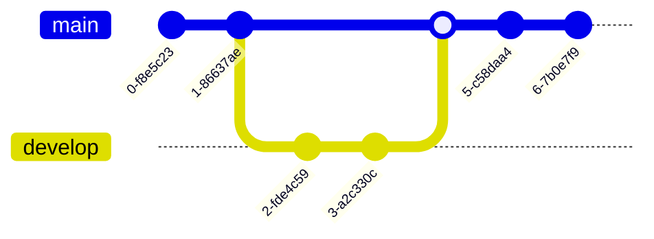

# Hello

This is my **first Docusaurus document**!

Let $f\colon[a,b]\to\R$ be Riemann integrable. Let $F\colon[a,b]\to\R$ be
$F(x)=\int_{a}^{x} f(t)\,dt$. Then $F$ is continuous, and at all $x$ such that
$f$ is continuous at $x$, $F$ is differentiable at $x$ with $F'(x)=f(x)$.

$$
I = \int_0^{2\pi} \sin(x)\,dx
$$
你好 数学世界

Diagrams can be rendered using Mermaid in a code block.

